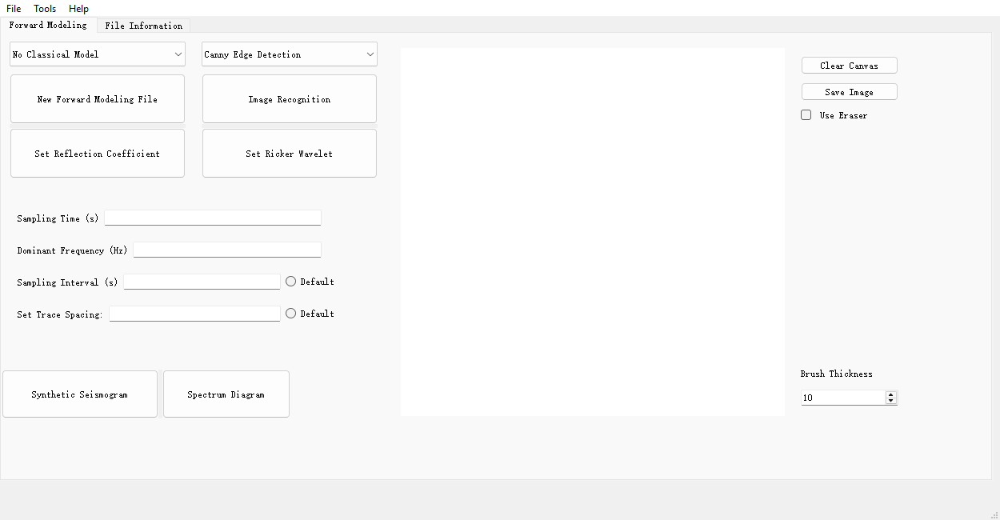
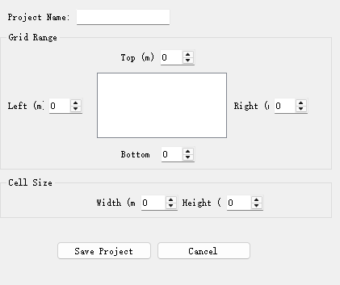
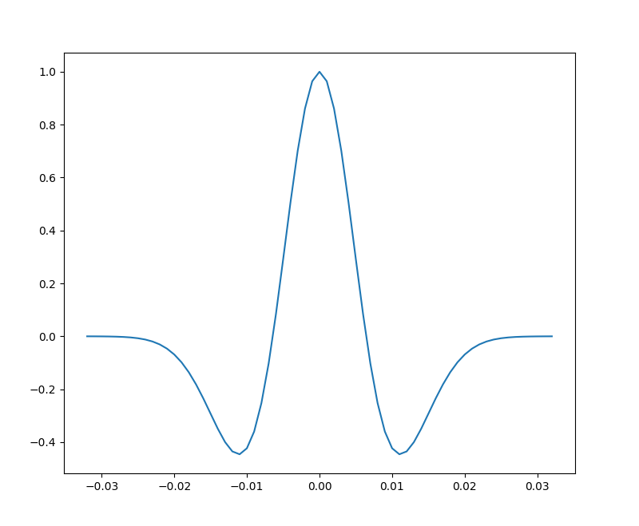
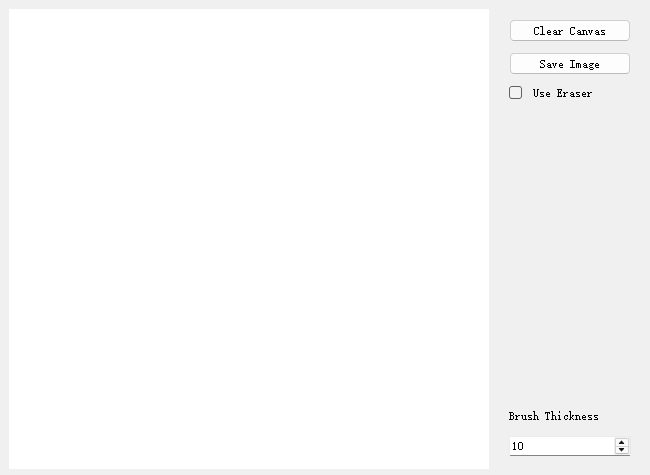
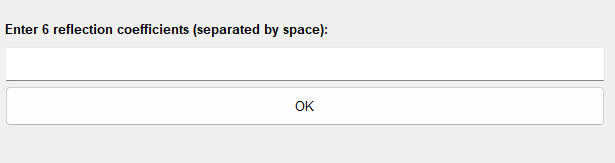
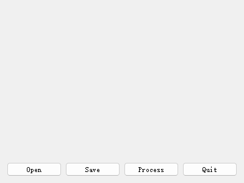

# Seismic Forward Modeling Software

> Professional PyQt5-based application for Forward Modeling simulation of seismic waves

---

## Software Interface Overview

### Main Application Window


**Key Regions:**
- **Left Panel** (Green): Project and wavelet control buttons
- **Center Area** (Blue): Interactive drawing canvas for geological models
- **Right Panel** (Salmon): Sampling parameter inputs

---

## Complete Step-by-Step Tutorial with Screenshots

### Step 1: Create New Project

**Button:** Click "New Forward Modeling File"



**Configuration Options:**

| Field | Purpose | Example |
|-------|---------|---------|
| Project Name | Identifier for your project | `Demo_Seismic` |
| Grid Range | Model spatial boundaries | Left: 0, Right: 1000m |
| Cell Size | Grid discretization | Width: 10m, Height: 5m |

**Action:** Click "Save Project" to store settings in `project.json`

---

### Step 2: Set Sampling Parameters

**Location:** Right panel of main window

**Required Parameters:**

```
Sampling Time (s):     0.032
Dominant Frequency:    35 Hz  
Sampling Interval (s): 0.001
```

These define the temporal characteristics of your simulation.

---

### Step 3: Generate Ricker Wavelet

**Button:** Click "Set Ricker Wavelet"



**What You See:**
- Time-series plot of the Ricker wavelet
- X-axis: Time (seconds)
- Y-axis: Amplitude
- Settings automatically saved

**Formula:**
```
ψ(t) = (1 - 2π²f²t²) × exp(-π²f²t²)

Where:
  f = Dominant Frequency (Hz)
  t = Time (s)
```

---

### Step 4: Draw Geological Model (Optional)

**Location:** Center canvas in main window



**Drawing Tools Available:**

| Tool | Keyboard/Mouse | Function |
|------|----------------|----------|
| Draw | Left Click + Drag | Sketch geological layers |
| Eraser | "Use Eraser" checkbox | Remove parts of drawing |
| Clear | "Clear Canvas" button | Erase everything |
| Save | "Save Image" button | Export to __data.png |
| Thickness | Spinbox (2-20px) | Control brush width |

**Tips:**
- Use different positions for different layers
- Higher positions = shallower layers
- Lower positions = deeper layers

---

### Step 5: Set Reflection Coefficients

**Button:** Click "Set Reflection Coefficient"



**Input Guidelines:**

| Parameter | Range | Meaning |
|-----------|-------|---------|
| Each coefficient | -1.0 to 1.0 | Fraction of wave amplitude reflected |
| Number of values | Must = layers | One coefficient per boundary |

**Example for 4-layer model:**
```
0.5 0.6 0.6 0.4
│   │   │   │
├─┘ └─┬─┘ └─┬──── Reflection coefficients
│      │      └──────── Each layer boundary
│      └───────────────── Space-separated
└─────────────────────── Required format
```

**Validation:**
- Values outside -1 to 1 → Error message
- Coefficient count ≠ layer count → Count mismatch error

---

### Step 6: Synthetic Seismogram Generation

**Button:** Click "Synthetic Seismogram"

**Behind the Scenes:**
```
Ricker Wavelet
     ↓
   × Reflection Coefficients  ( Convolution)
     ↓
Synthetic Seismogram
```

**Output Display:**
- Wiggle plot format showing seismic traces
- Each vertical line = one seismic trace
- Filled areas = positive amplitudes
- Trace positions = model horizontal locations

---

### Step 7: Image Recognition / Edge Detection

**Location:** Top right dropdown and button



**Available Algorithms:**

| Algorithm | Best Use Case | Key Feature |
|-----------|---------------|-------------|
| **Canny** | General edges | Sub-pixel accuracy |
| **Sobel** | Strong gradients | Fast, Edge magnitude |
| **Scharr** | Precise angles | Better directional info |
| **Laplacian** | Zero crossings | High sensitivity |

**Processing Steps:**
1. Select algorithm from dropdown
2. Load image (must have __data.png)
3. Click "Image Recognition"
4. View processed edges in new window

